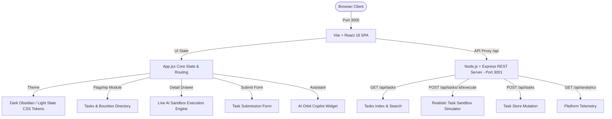

# 🌌 AI Orbit — Intelligence, Workflows & Ecosystem Platform

<div align="center">


[](https://react.dev/)
[](https://vitejs.dev/)
[](https://tailwindcss.com/)
[](https://expressjs.com/)
[](https://nodejs.org/)

**The premier end-to-end platform for AI Tasks, Autonomous Agent Workflows, Enterprise Business Tools, LLM Leaderboards, Physical Robotics, and AI Education.**

[View Live Repository](https://github.com/lokeshpadarthi07-collab/AI-Orbit) • [Report Issues](https://github.com/lokeshpadarthi07-collab/AI-Orbit/issues)

</div>

---

## 📖 Overview & Design Direction

**AI Orbit** is built for the **Module Design & Development Task** (Internship Selection Round). The platform adheres 100% to the **AI Orbit visual identity** (`aiorbit.club`):

- 🖤 **Obsidian Dark Mode**: Deep black background (`#09090b` / `#030712`) with radial mesh glowing backgrounds.
- 💎 **Glassmorphism Cards**: Translucent glass surfaces (`rgba(18, 18, 24, 0.75)`) with subtle `1px` glowing borders (`#27272a`).
- ⚡ **High-Contrast Typography**: Modern typography hierarchy (Inter, Plus Jakarta Sans, JetBrains Mono).
- ☀️🌙 **Seamless Theme Toggle**: One-click Sun/Moon button switching between Dark Obsidian Mode and Light Slate Mode (`#f8fafc`).
- 🎯 **100% Clickable Interactive Navigation**: Every card, badge, button, tab, drawer, and modal responds instantly with smooth scrolling.

---

## 🔥 Key Modules & Feature Highlights

### 1. Flagship AI Tasks & Workflows Directory (`/tasks`)
- **Dual Layout Toggle**: Instant switching between **Grid View** and **List View**.
- **Multi-Faceted Filtering**: Filter by Category (*Autonomous Agents, Code Generation, Data Extraction, Computer Vision, Fine-Tuning, LLM Benchmarks*), Business Function (*Engineering, Sales, Marketing, Legal, Finance, Operations, HR*), Difficulty Level (*Beginner to Frontier*), and Status (*Active Bounties $500–$1,500 USDC vs. Verified*).
- **Multi-Property Sorting**: Sort by Highest Bounty Reward, Rating, Bookmarked Count, or Newest.

### 2. High-Precision Live AI Execution Sandbox (`TaskDetailModal.jsx`)
- Deep-dive specification modal for any AI task.
- **Interactive Sandbox Simulator**: Select target LLMs (`Claude 3.5 Sonnet`, `GPT-4o`, `Gemini 1.5 Pro`, `Llama 3.1 70B`), adjust parameters, and click **Execute Workflow Simulation** to watch live streaming console logs, latency counters, token metrics, and task-specific structured JSON outputs (e.g. scraped OpenAPI payloads, SQLi/ReDoS OWASP CVE reports, and unified git diff patches!).
- Includes Community Discussions, Solution Leaderboards, and auto-generated Python & Node.js code integration snippets.

### 3. Full Multi-Module Ecosystem Navigation
- **`/business` (AI Tools by Business Function)**: Ref: *[Futurepedia.io/business-function](https://futurepedia.io)* — Categorized software directory with an **Interactive Enterprise Team ROI Calculator slider**.
- **`/leaderboard` (LLM Model ELO Leaderboard)**: Dynamic rankings table featuring a **Side-by-Side LLM Arena Battle comparison modal**.
- **`/companies` (AI Ecosystem & Research Labs)**: Directory of Anthropic, OpenAI, DeepMind, and Cognition with valuation metrics and an **Interactive Engineering Job Application Engine**.
- **`/robots` (Physical AI & Humanoid Robotics)**: Hardware index of Figure 02, Unitree H1/G1, and Optimus Gen 2 with a **Joint Kinematics Telemetry Simulator**.
- **`/learn` (AI Courses & Guides Hub)**: Ref: *[TheRundown.ai/guides](https://therundown.ai)* — Educational hub with an **Interactive Course Chapter Syllabus Player**.
- **`/analytics` (Platform Telemetry)**: Real-time telemetry dashboard with visual task distribution bar charts.

### 4. Interactive Copilot & Task Submission Engine
- 🤖 **AI Orbit Copilot Widget**: Floating assistant in the bottom-right corner answering queries with technical accuracy and quick-prompt action buttons.
- ✨ **Task Submission Modal (`SubmitTaskModal.jsx`)**: Form to create and submit new AI tasks (`POST /api/tasks`) with instant client & REST API sync, rendering a glowing **`✨ NEW SUBMISSION`** badge.
- 🔍 **Universal Search (`Ctrl + K`)**: Keyboard shortcut popover search spanning tasks, tools, companies, and guides.
- 🔖 **Saved Bookmarks Drawer**: Sliding drawer managing bookmarked modules.

---

## 🛠️ Tech Stack & Architecture



| Layer | Technology | Purpose |
| :--- | :--- | :--- |
| **Frontend** | React 18, Vite 5 | SPA UI framework & fast HMR bundling |
| **Styling** | Tailwind CSS 3, Vanilla CSS | AI Orbit obsidian dark theme, glassmorphism, glowing badges |
| **Icons** | Lucide React | Modern minimal icon set |
| **Backend** | Node.js, Express.js | REST API server providing data, search, sandbox execution, & submissions |
| **State** | React State + REST Sync | Reactive local state fallback with REST persistence |

---

## 🚀 Getting Started & Local Setup

### 1. Prerequisites
Ensure you have **Node.js (v18+)** and **npm (v9+)** installed on your system.

### 2. Clone Repository & Install Dependencies
```bash
git clone https://github.com/lokeshpadarthi07-collab/AI-Orbit.git
cd AI-Orbit
npm install
```

### 3. Run Development Servers
Start both the Express REST server (Port 3001) and Vite frontend (Port 3000) simultaneously:
```bash
npm start
```

Or start servers individually in separate terminals:
```bash
# Terminal 1: Backend REST API Server (Port 3001)
npm run server

# Terminal 2: Frontend Vite Development Server (Port 3000)
npm run dev
```

### 4. Open in Browser
Visit **`http://localhost:3000/`** to run the application.

---

## 📡 REST API Reference Documentation

| Method | Endpoint | Description |
| :--- | :--- | :--- |
| `GET` | `/api/tasks` | Fetch tasks with query parameters (`search`, `category`, `difficulty`, `businessFunction`, `sort`) |
| `GET` | `/api/tasks/:id` | Fetch single task details + community discussion comments |
| `POST` | `/api/tasks` | Submit new AI task/workflow module |
| `POST` | `/api/tasks/:id/execute` | Execute high-precision realistic AI sandbox simulation |
| `POST` | `/api/tasks/:id/bookmark` | Toggle saved bookmark state for a task |
| `POST` | `/api/tasks/:id/comments` | Post a new comment to a task discussion thread |
| `GET` | `/api/business` | Fetch AI tools by business function |
| `GET` | `/api/leaderboard` | Fetch LLM model ELO rankings & benchmarks |
| `GET` | `/api/companies` | Fetch AI ecosystem companies & open engineering roles |
| `GET` | `/api/robots` | Fetch physical AI & humanoid robotics directory |
| `GET` | `/api/learn` | Fetch AI courses, e-books, and guides |
| `GET` | `/api/analytics` | Fetch platform telemetry metrics |

---

## 📁 Repository Structure

```
AI-Orbit/
├── package.json               # Dependencies, scripts (dev, build, server, start)
├── vite.config.js             # Vite configuration with API proxy to port 3001
├── tailwind.config.js         # AI Orbit theme color tokens & glow shadows
├── postcss.config.js          # PostCSS configuration
├── index.html                 # Entry HTML with Google Fonts
├── README.md                  # Project documentation
├── server/
│   ├── index.js               # Express REST API server routes & endpoints
│   └── data.js                # Rich datasets (Tasks, Business, Leaderboard, Companies, Robots, Learn)
└── src/
    ├── main.jsx               # React DOM root entry
    ├── index.css              # AI Orbit CSS design system, glassmorphism, Light/Dark tokens
    ├── App.jsx                # Core application routing, modal state, & theme controller
    └── components/
        ├── Navbar.jsx          # Header navbar with route tabs, search, arena & theme toggle
        ├── HeroBanner.jsx      # Dark obsidian hero banner, metrics ticker & quick filters
        ├── TasksModule.jsx     # Flagship /tasks listing view (Grid vs List toggle)
        ├── TaskDetailModal.jsx # Task specification & Live AI Sandbox Execution Engine
        ├── BusinessModule.jsx  # /business AI Tools by Business Function
        ├── BusinessToolModal.jsx # Enterprise Tool Detail & Interactive ROI Calculator
        ├── LeaderboardModule.jsx # /leaderboard LLM Model ELO Rankings Table
        ├── CompareModelsModal.jsx # Side-by-Side LLM Arena Battle comparison
        ├── CompaniesModule.jsx # /companies AI Ecosystem Directory
        ├── CompanyDetailModal.jsx # Company details & Job Application Engine
        ├── RobotsModule.jsx    # /robots Physical AI & Robotics Directory
        ├── RobotDetailModal.jsx # Humanoid Hardware & Kinematics Telemetry Simulator
        ├── LearnModule.jsx     # /learn AI Courses & Guides Hub
        ├── CourseDetailModal.jsx # Interactive Course Syllabus & Video Player
        ├── AnalyticsModule.jsx # /analytics Platform Telemetry & Distribution Charts
        ├── SubmitTaskModal.jsx # Submit new AI module form
        ├── GlobalSearchModal.jsx # Ctrl + K universal quick search popover
        ├── BookmarksDrawer.jsx # Saved items sliding drawer
        ├── CopilotWidget.jsx   # Floating AI Orbit Copilot Assistant
        └── Toast.jsx           # Feedback notification toasts
```

---

## 📄 License & Attribution

Built for the **Module Design & Development Submission**. Design system referenced from **AI Orbit** (`aiorbit.club`), **Futurepedia**, and **The Rundown AI**.
